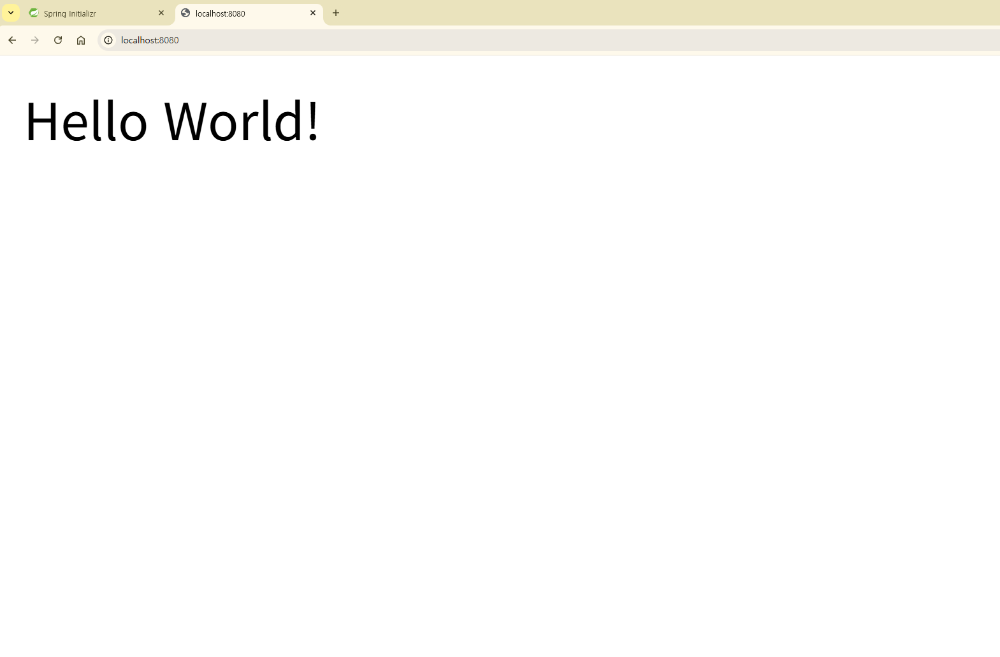
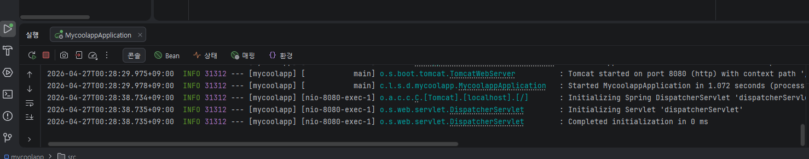
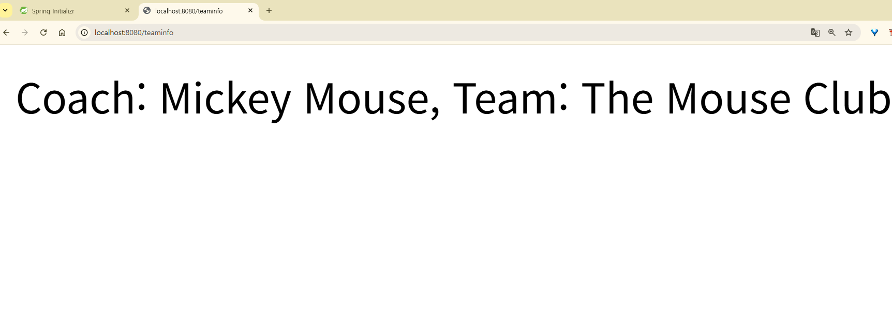

# 학습 문서

## Section 1: Spring Boot 시작하기

### 1-1. Spring Boot 개요
- Spring Boot는 Spring Framework를 기반으로 자동 설정(Auto Configuration)과
  내장 서버(Embedded Tomcat)를 제공하여 설정을 최소화해주는 프레임워크
- 기존 Spring은 XML 설정이 복잡했는데, Spring Boot는 이를 자동으로 처리

### 1-2. 프로젝트 생성 (Spring Initializr)
- https://start.spring.io 에서 프로젝트 생성
- 설정값:
    - Project: Maven
    - Language: Java
    - Spring Boot: 4.x
    - Dependencies: Spring Web
- 생성된 프로젝트를 IntelliJ에서 Import

### 1-3. REST Controller 생성 - Hello World

**핵심 개념:**
- `@SpringBootApplication`: 앱의 시작점. 자동 설정 + 컴포넌트 스캔 수행
- `@RestController`: 이 클래스가 REST API 요청을 처리한다는 것을 Spring에 알림
- `@GetMapping("/")`: HTTP GET 요청을 해당 메서드에 매핑

**코드:**
```java
package com.luv2code.springboot.demo.mycoolapp.rest;

import org.springframework.web.bind.annotation.GetMapping;
import org.springframework.web.bind.annotation.RestController;

@RestController
public class FunRestController {

    // "/" 엔드포인트로 GET 요청이 오면 "Hello World!" 반환
    @GetMapping("/")
    public String sayHello() {
        return "Hello World!";
    }
}
```

**실행 결과:**




**배운 점:**
- Spring Boot 앱을 실행하면 내장 Tomcat이 8080 포트에서 자동으로 시작됨
- REST Controller를 만들면 별도 설정 없이 바로 HTTP 요청 처리 가능
- 콘솔 로그에서 Tomcat 시작, 포트 번호, 초기화 시간 등을 확인할 수 있음

### 1-4. Maven 이란?
- Java 프로젝트 관리 도구. 빌드 + 의존성 관리에 사용
- pom.xml에 필요한 라이브러리(JAR)를 적으면 Maven이 자동으로 다운로드
- Spring Boot 프로젝트는 기본적으로 Maven을 사용

### 1-5. POM 파일과 GAV
- POM = Project Object Model, Maven 설정 파일 (Maven의 쇼핑 목록)
- GAV: 프로젝트를 고유 식별하는 3요소
  - **Group ID**: 회사/조직 (예: com.luv2code)
  - **Artifact ID**: 프로젝트 이름 (예: mycoolapp)
  - **Version**: 버전 (예: 1.0-SNAPSHOT)

### 1-6. Spring Boot 프로젝트 구조
- `src/main/java`: Java 소스 코드
- `src/main/resources`: 설정 파일, properties 등
- `src/main/resources/static`: 정적 리소스 (HTML, CSS, JS, 이미지)
- `src/main/resources/templates`: 템플릿 파일 (Thymeleaf 등)
- `src/test/java`: 단위 테스트
- `mvnw`, `mvnw.cmd`: Maven Wrapper (Maven 미설치 시 자동 다운로드)
- `pom.xml`: Maven 설정 파일
- `target/`: 빌드 결과물

### 1-7. Spring Boot Starters
- 검증된 의존성 묶음
- pom.xml에 starter 하나 추가하면 관련 라이브러리가 한꺼번에 들어옴
- 예: `spring-boot-starter-web` → Spring MVC + Tomcat + JSON 등 자동 포함
- IntelliJ Maven 탭에서 starter 안에 뭐가 들어있는지 확인 가능

### 1-8. application.properties
**위치:** `src/main/resources/application.properties`
**용도:** Spring Boot 설정값 + 커스텀 properties 정의

**예시 코드:**
\`\`\`properties
# 서버 포트 변경
server.port=8585

# 커스텀 properties
coach.name=Mickey Mouse
team.name=The Mouse Club
\`\`\`

**@Value로 코드에서 사용:**
\`\`\`java
@Value("${coach.name}")
private String coachName;

@Value("${team.name}")
private String teamName;

@GetMapping("/teaminfo")
public String getTeamInfo() {
return "Coach: " + coachName + ", Team: " + teamName;
}
\`\`\`

**실행 결과:**


**배운 점:**
- 설정값을 코드에 하드코딩하지 않고 외부 파일로 관리하면 유지보수 편리
- @Value 어노테이션은 import 필수: `import org.springframework.beans.factory.annotation.Value;`

### ⚠️ 트러블슈팅: cannot find symbol class Value

**상황:** @Value 어노테이션 사용 시 빌드 오류 발생
**오류 메시지:** `cannot find symbol class Value`
**원인:** @Value 어노테이션 import 문 누락
**해결:** import 추가

\`\`\`java
import org.springframework.beans.factory.annotation.Value;
\`\`\`

**배운 점:** 어노테이션은 반드시 해당 패키지를 import해야 사용 가능.
IntelliJ에서 `Alt + Enter`로 자동 import 가능.

---

## Section 1 마무리 정리
- Spring Boot의 기본 구조와 Maven 의존성 관리 방식 학습
- Hello World REST API와 application.properties 활용법 체득
- 다음 Section부터 Spring Core (DI, IoC) 본격 학습 예정