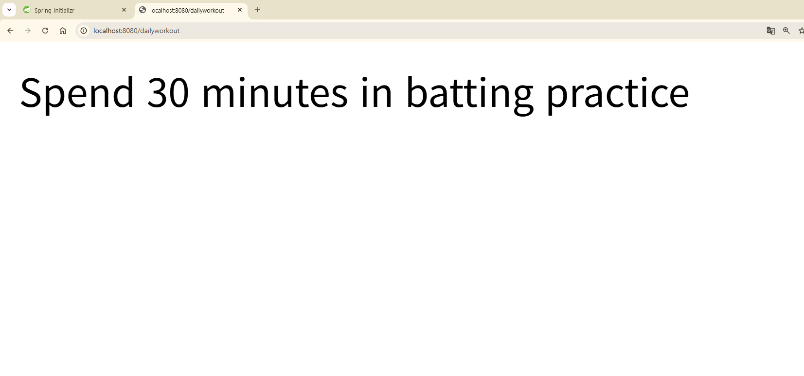
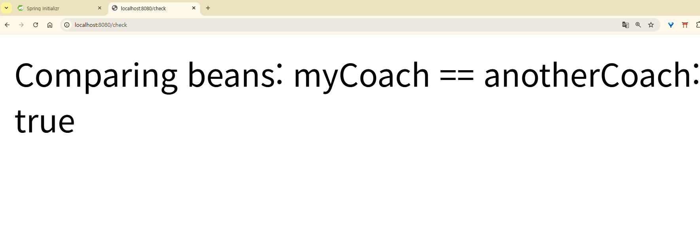
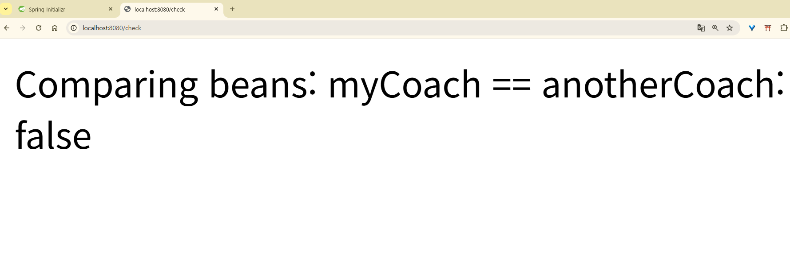
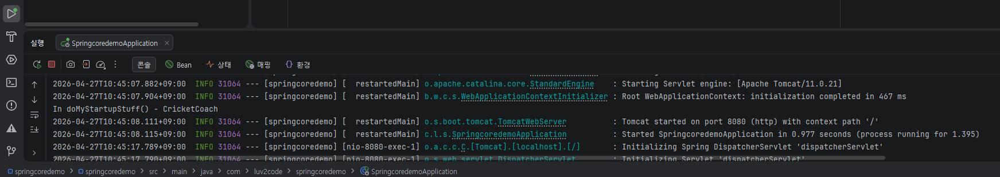
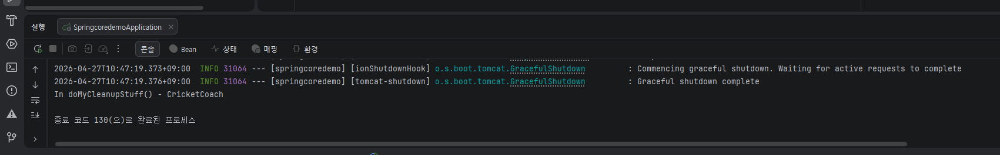

# Section 2: Spring Core

## 2-1. IoC (제어의 역전)
- 객체 생성/관리를 개발자가 아닌 Spring이 대신 해줌
- Spring 컨테이너 = Object Factory 역할

## 2-2. DI (의존성 주입)
- 객체가 필요한 의존성을 직접 만들지 않고 Spring에게 받아 씀
- Constructor Injection: 필수 의존성, Spring 공식 권장
- Setter Injection: 선택적 의존성

## 2-3. Constructor Injection 실습

**파일 구조:**
- Coach.java (인터페이스)
- CricketCoach.java (구현체)
- DemoController.java (REST Controller)

**Coach.java**
\`\`\`java
public interface Coach {
String getDailyWorkout();
}
\`\`\`

**CricketCoach.java**
\`\`\`java
@Component
public class CricketCoach implements Coach {
@Override
public String getDailyWorkout() {
return "Practice fast bowling for 15 minutes";
}
}
\`\`\`

**DemoController.java**
\`\`\`java
@RestController
public class DemoController {

    private Coach myCoach;

    @Autowired
    public DemoController(Coach theCoach) {
        myCoach = theCoach;
    }

    @GetMapping("/dailyworkout")
    public String getDailyWorkout() {
        return myCoach.getDailyWorkout();
    }
}
\`\`\`

**실행 결과:**

**배운 점:**
- @Component: 클래스를 Spring Bean으로 등록
- @Autowired: Spring에게 의존성 주입 요청
- @GetMapping: HTTP GET 요청을 메서드에 매핑
- 생성자가 하나뿐이면 @Autowired 생략 가능

## ⚠️ 트러블슈팅
- @Component 등 어노테이션 import 안되면 Alt+Enter로 수동 추가
- DevTools 자동 리로드 안되면:
  Settings → Advanced Settings → Allow auto-make 체크
  Settings → Build → Compiler → Build project automatically 체크

## 2-4. Component Scanning

### 핵심 개념
- `@SpringBootApplication` = `@EnableAutoConfiguration` + `@ComponentScan` + `@Configuration`
- 기본 스캔 범위: 메인 애플리케이션 클래스가 있는 패키지 + 모든 하위 패키지
- 메인 패키지 바깥에 클래스를 만들면 자동 스캔 안 됨

### 외부 패키지 스캔 시 (scanBasePackages)
\`\`\`java
@SpringBootApplication(
scanBasePackages = {
"com.luv2code.springcoredemo",
"com.luv2code.util"
}
)
public class SpringcoredemoApplication { ... }
\`\`\`

### ⚠️ 트러블슈팅: Bean을 찾지 못하는 오류

**오류 메시지:** `Parameter 0 of constructor in DemoController required a bean of type 'Coach' that could not be found`

**원인:**
- Bean 클래스가 컴포넌트 스캔 범위 밖에 있음
- 또는 `@Component` 어노테이션을 빠뜨림

**해결:** `@Component` 추가, 또는 `scanBasePackages`로 패키지 명시

---

## 2-5. Qualifiers (@Qualifier)

### 문제 상황
같은 인터페이스 구현체가 여러 개일 때, Spring은 어떤 걸 주입할지 모름.

**오류 메시지:** `required a single bean, but N were found`

### 해결: @Qualifier로 명시적 지정

\`\`\`java
@RestController
public class DemoController {

    private Coach myCoach;

    @Autowired
    public DemoController(@Qualifier("baseballCoach") Coach theCoach) {
        myCoach = theCoach;
    }
}
\`\`\`

**Bean ID 규칙:** 클래스 이름에서 첫 글자만 소문자
- `CricketCoach` → `cricketCoach`
- `BaseballCoach` → `baseballCoach`
- `TrackCoach` → `trackCoach`
- `TennisCoach` → `tennisCoach`

**실행 결과 (BaseballCoach 주입):**

### 배운 점
- 인터페이스 구현체가 여러 개일 때는 반드시 어떤 걸 쓸지 지정해야 함
- Spring 오류 메시지 하단의 힌트(Action 섹션)를 보면 해결 방법이 나옴

---

## 2-6. Bean Scopes (@Scope)

### Scope 종류

| Scope | 설명 |
|-------|------|
| **singleton** (기본값) | 인스턴스 하나만 생성, 모두 공유 |
| **prototype** | 주입할 때마다 새 인스턴스 생성 |
| request | HTTP 요청 단위 (웹 앱 전용) |
| session | HTTP 세션 단위 (웹 앱 전용) |
| application | ServletContext 단위 (웹 앱 전용) |
| websocket | 웹소켓 단위 (웹 앱 전용) |

### Singleton (기본 동작)
\`\`\`java
@Component
public class CricketCoach implements Coach { ... }
// 같은 cricketCoach 두 번 주입해도 같은 인스턴스
\`\`\`

**확인 결과:** `myCoach == anotherCoach` → **true**

### Prototype 전환
\`\`\`java
@Component
@Scope(ConfigurableBeanFactory.SCOPE_PROTOTYPE)
public class CricketCoach implements Coach { ... }
\`\`\`

**확인 결과:** `myCoach == anotherCoach` → **false**

### 비교 코드
\`\`\`java
@GetMapping("/check")
public String check() {
return "Comparing beans: myCoach == anotherCoach: "
+ (myCoach == anotherCoach);
}
\`\`\`

---

## 2-7. Bean Lifecycle Methods

### 생명주기 흐름

앱 시작>
생성자 실행>
의존성 주입>
@PostConstruct 메서드 실행 (초기화)>
Bean 사용 가능>
앱 종료>
@PreDestroy 메서드 실행 (정리)>
Bean 소멸

### 코드 예시

\`\`\`java
@Component
public class CricketCoach implements Coach {

    public CricketCoach() {
        System.out.println("In constructor: " + getClass().getSimpleName());
    }

    @PostConstruct
    public void doMyStartupStuff() {
        System.out.println("In doMyStartupStuff() - " + getClass().getSimpleName());
    }

    @PreDestroy
    public void doMyCleanupStuff() {
        System.out.println("In doMyCleanupStuff() - " + getClass().getSimpleName());
    }

    @Override
    public String getDailyWorkout() {
        return "Practice fast bowling for 15 minutes";
    }
}
\`\`\`

### 실행 로그

**앱 시작 시 (@PostConstruct 실행):**

**앱 종료 시 (@PreDestroy 실행):**

### 사용 사례
- `@PostConstruct`: DB 연결, 외부 API 핸들 설정, 캐시 초기화
- `@PreDestroy`: DB 연결 해제, 파일 핸들 닫기, 리소스 반납

---

## Section 2 마무리

### 배운 핵심 어노테이션 정리

| 어노테이션 | 용도 |
|-----------|------|
| `@Component` | 클래스를 Spring Bean으로 등록 |
| `@Autowired` | 의존성 자동 주입 |
| `@Qualifier("beanId")` | 어떤 Bean을 주입할지 명시 |
| `@Scope` | Bean 생명 범위 지정 |
| `@PostConstruct` | Bean 생성 직후 실행 |
| `@PreDestroy` | Bean 소멸 직전 실행 |
| `@SpringBootApplication` | 메인 애플리케이션 (스캔 + 자동 설정) |

### Section 2 핵심 개념 한 줄 요약
**"Spring이 객체를 직접 만들고 관리해주니까(IoC) 우리는 어떤 걸 주입받을지만 지정하면 된다(DI)"**

다음 Section부터는 실제 데이터베이스 연동(JPA/Hibernate)을 다룰 예정.