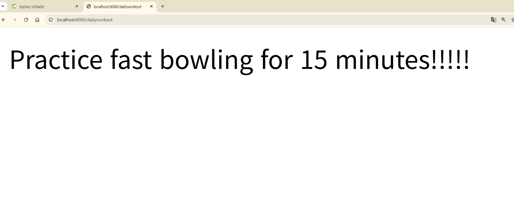

# Section 2: Spring Core

## 2-1. IoC (제어의 역전)
- 객체 생성/관리를 개발자가 아닌 Spring이 대신 해줌
- Spring 컨테이너 = Object Factory 역할

## 2-2. DI (의존성 주입)
- 객체가 필요한 의존성을 직접 만들지 않고 Spring에게 받아 씀
- Constructor Injection: 필수 의존성, Spring 공식 권장
- Setter Injection: 선택적 의존성

## 2-3. Constructor Injection 실습

**파일 구조:**
- Coach.java (인터페이스)
- CricketCoach.java (구현체)
- DemoController.java (REST Controller)

**Coach.java**
\`\`\`java
public interface Coach {
String getDailyWorkout();
}
\`\`\`

**CricketCoach.java**
\`\`\`java
@Component
public class CricketCoach implements Coach {
@Override
public String getDailyWorkout() {
return "Practice fast bowling for 15 minutes";
}
}
\`\`\`

**DemoController.java**
\`\`\`java
@RestController
public class DemoController {

    private Coach myCoach;

    @Autowired
    public DemoController(Coach theCoach) {
        myCoach = theCoach;
    }

    @GetMapping("/dailyworkout")
    public String getDailyWorkout() {
        return myCoach.getDailyWorkout();
    }
}
\`\`\`

**실행 결과:**

**배운 점:**
- @Component: 클래스를 Spring Bean으로 등록
- @Autowired: Spring에게 의존성 주입 요청
- @GetMapping: HTTP GET 요청을 메서드에 매핑
- 생성자가 하나뿐이면 @Autowired 생략 가능

## ⚠️ 트러블슈팅
- @Component 등 어노테이션 import 안되면 Alt+Enter로 수동 추가
- DevTools 자동 리로드 안되면:
  Settings → Advanced Settings → Allow auto-make 체크
  Settings → Build → Compiler → Build project automatically 체크