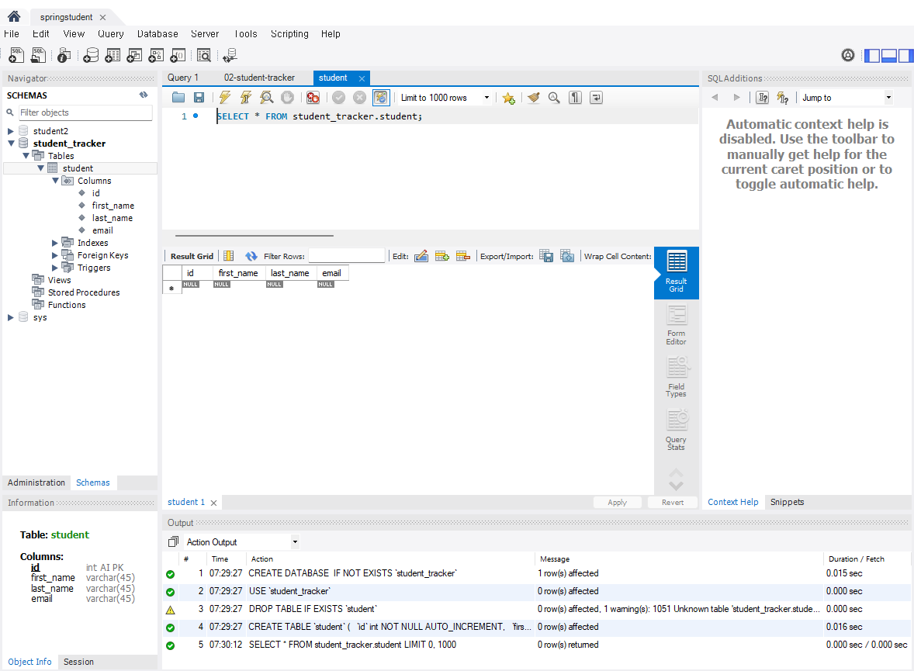

# Section 3: Hibernate/JPA CRUD

## 3-1. Hibernate / JPA 개요

이번 Section에서는 Spring Boot 애플리케이션에서 데이터베이스를 다루기 위한 Hibernate와 JPA를 학습한다.

Hibernate는 Java 객체를 데이터베이스에 저장하거나, 데이터베이스에서 다시 조회할 수 있도록 도와주는 ORM 프레임워크이다.

ORM은 Object-to-Relational Mapping의 약자로, Java 객체와 관계형 데이터베이스 테이블을 서로 연결해주는 기술이다.

예를 들어 Java 코드에서는 다음과 같은 `Student` 클래스가 있을 수 있다.

```java
public class Student {
    private int id;
    private String firstName;
    private String lastName;
    private String email;
}
```

반면 데이터베이스에는 다음과 같은 `student` 테이블이 존재할 수 있다.

```text
student
- id
- first_name
- last_name
- email
```

Java에서는 `firstName`, `lastName`처럼 CamelCase를 사용하지만, 데이터베이스에서는 `first_name`, `last_name`처럼 언더스코어 형식을 사용하는 경우가 많다. Hibernate/JPA는 이런 Java 필드와 DB 컬럼 사이의 매핑을 처리해준다.

---

## 3-2. Hibernate를 사용하는 이유

Hibernate를 사용하면 개발자가 직접 작성해야 하는 JDBC 코드와 SQL 코드의 양을 줄일 수 있다.

기존 JDBC 방식에서는 개발자가 직접 SQL을 작성하고, `Connection`, `PreparedStatement`, `ResultSet` 등을 다루어야 한다.

하지만 Hibernate/JPA를 사용하면 Java 객체를 중심으로 코드를 작성할 수 있다.

예를 들어 객체를 저장할 때는 다음과 같은 방식으로 처리할 수 있다.

```java
Student student = new Student("Paul", "Doe", "paul@luv2code.com");

entityManager.persist(student);
```

이 코드에서 `entityManager.persist(student)`를 호출하면, JPA가 매핑 정보를 바탕으로 `Student` 객체를 적절한 테이블과 컬럼에 저장한다.

즉, 개발자는 “객체를 저장한다”는 관점에서 코드를 작성하고, 실제 SQL 실행은 Hibernate/JPA가 내부적으로 처리한다.

---

## 3-3. JPA란?

JPA는 Jakarta Persistence API의 약자이다.

이전에는 Java Persistence API라고 불렸다.

JPA는 ORM을 위한 표준 API이다.
다만 JPA 자체는 실제 동작하는 라이브러리가 아니라, 인터페이스와 규칙을 정의한 명세이다.

즉, JPA를 실제로 사용하려면 구현체가 필요하다.

대표적인 JPA 구현체는 다음과 같다.

* Hibernate
* EclipseLink

이 중 Hibernate는 가장 널리 사용되는 JPA 구현체이며, Spring Boot에서 기본적으로 사용되는 JPA 구현체이기도 하다.

JPA를 사용하면 특정 구현체에 완전히 종속되지 않고, 표준 API를 기준으로 코드를 작성할 수 있다. 이론적으로는 EclipseLink를 사용하다가 Hibernate로 바꾸는 것도 가능하다.

---

## 3-4. Hibernate/JPA와 JDBC의 관계

Hibernate/JPA를 사용한다고 해서 JDBC가 사라지는 것은 아니다.

Hibernate/JPA는 내부적으로 JDBC를 사용해서 데이터베이스와 통신한다.

구조를 단순하게 표현하면 다음과 같다.

```text
Spring Boot 애플리케이션
        ↓
JPA API
        ↓
Hibernate
        ↓
JDBC API
        ↓
JDBC Driver
        ↓
MySQL Database
```

개발자는 JPA API를 사용해서 객체를 저장하고 조회하지만, 내부적으로 실제 데이터베이스 통신은 JDBC를 통해 이루어진다.

따라서 Hibernate/JPA는 JDBC 위에 올라가 있는 추상화 계층이라고 볼 수 있다.

이후 Spring Boot 프로젝트에서 MySQL에 연결할 때도 JDBC Driver를 설정하게 된다.

---

## 3-5. MySQL 개발 환경

이번 강의에서는 CRUD 실습을 위해 MySQL 데이터베이스를 사용한다.

MySQL 환경은 크게 두 가지 구성 요소로 나눌 수 있다.

### MySQL Database Server

MySQL Database Server는 실제 데이터를 저장하고 관리하는 데이터베이스 엔진이다.

데이터 생성, 조회, 수정, 삭제 같은 CRUD 작업은 이 서버를 대상으로 이루어진다.

### MySQL Workbench

MySQL Workbench는 MySQL Database Server에 접속하기 위한 GUI 도구이다.

Workbench를 사용하면 다음 작업을 할 수 있다.

* 데이터베이스 스키마 생성
* 테이블 생성
* SQL 쿼리 실행
* 데이터 조회
* 데이터 삽입, 수정, 삭제
* 사용자 계정 생성 및 권한 관리

이번 실습에서는 MySQL Workbench를 사용해서 사용자 계정과 `student` 테이블을 생성했다.

---

## 3-6. 데이터베이스 테이블 설정 개요

JPA 실습을 진행하기 위해 강의에서 제공하는 SQL 스크립트를 사용했다.

사용한 폴더와 파일은 다음과 같다.

```text
00-starter-sql-scripts/
├── 01-create-user.sql
└── 02-student-tracker.sql
```

### 01-create-user.sql

`01-create-user.sql` 파일은 Spring Boot 애플리케이션에서 사용할 MySQL 사용자를 생성한다.

생성한 사용자 정보는 다음과 같다.

```text
User ID: springstudent
Password: springstudent
```

root 계정으로 MySQL Workbench에 접속한 뒤, 해당 SQL 파일을 실행하여 `springstudent` 사용자를 생성했다.

이후 MySQL Workbench에서 `springstudent`라는 새 Connection을 만들고, Test Connection을 통해 정상 접속되는 것을 확인했다.

---

### 02-student-tracker.sql

`02-student-tracker.sql` 파일은 JPA 실습에서 사용할 데이터베이스 스키마와 테이블을 생성한다.

생성된 스키마 이름은 다음과 같다.

```text
student_tracker
```

생성된 테이블 이름은 다음과 같다.

```text
student
```

`student` 테이블에는 다음 네 개의 컬럼이 생성된다.

| 컬럼명          | 설명     |
| ------------ | ------ |
| `id`         | 기본 키   |
| `first_name` | 학생 이름  |
| `last_name`  | 학생 성   |
| `email`      | 이메일 주소 |

현재는 테이블 구조만 생성한 상태이므로 아직 데이터는 들어있지 않다.

이후 강의에서 Java 코드와 JPA `EntityManager`를 사용하여 `Student` 객체를 생성하고, 이 객체를 `student` 테이블에 저장하는 실습을 진행할 예정이다.

---

## 3-7. 실행 결과

MySQL Workbench에서 `student_tracker` 스키마와 `student` 테이블을 생성한 뒤, `student` 테이블을 조회했다.

아직 데이터를 삽입하지 않았기 때문에 조회 결과는 비어 있다.



---

## 3-8. 이번 범위에서 배운 점

이번 범위에서는 Hibernate, JPA, JDBC, MySQL의 관계를 학습했다.

정리하면 다음과 같다.

* Hibernate는 Java 객체를 데이터베이스에 저장하고 조회할 수 있게 해주는 ORM 프레임워크이다.
* JPA는 ORM을 위한 표준 API이고, Hibernate는 JPA의 대표적인 구현체이다.
* Hibernate/JPA는 JDBC를 대체하는 것이 아니라, 내부적으로 JDBC를 사용한다.
* 개발자는 JPA API를 통해 객체 중심으로 코드를 작성하고, 실제 SQL 처리와 DB 통신은 Hibernate/JPA가 도와준다.
* MySQL 실습을 위해 `springstudent` 사용자, `student_tracker` 스키마, `student` 테이블을 생성했다.
* 현재 `student` 테이블은 비어 있으며, 이후 Java 코드로 데이터를 삽입할 예정이다.

---

## 3-9. Spring Boot JPA 프로젝트 생성

이번 범위에서는 JPA 실습을 위한 새로운 Spring Boot 프로젝트를 생성했다.

Spring Initializr에서 다음 설정으로 프로젝트를 생성했다.

| 항목           | 설정값                           |
| ------------ | ----------------------------- |
| Project      | Maven                         |
| Language     | Java                          |
| Packaging    | Jar                           |
| Dependencies | MySQL Driver, Spring Data JPA |

생성한 프로젝트는 다음 경로에 추가했다.

```text
03-spring-boot-hibernate-jpa-crud/
└── 01-cruddemo-student/
```

이번 실습에서는 처음부터 REST API를 만들지 않고, `CommandLineRunner`를 사용하는 커맨드라인 애플리케이션으로 시작했다.

이렇게 하는 이유는 웹 요청이나 Controller 없이도 Spring Boot 애플리케이션이 실행된 직후 JPA/DAO 코드를 바로 테스트할 수 있기 때문이다.

나중에는 이 JPA 코드를 CRUD REST API에 연결할 예정이다.

---

## 3-10. Spring Boot의 DataSource 자동 설정

Spring Boot에서는 `pom.xml`에 추가된 의존성과 `application.properties`의 설정값을 바탕으로 데이터베이스 연결을 자동 설정한다.

이번 프로젝트에는 다음 의존성을 추가했다.

* MySQL Driver
* Spring Data JPA

Spring Boot는 이 정보를 보고 내부적으로 다음과 같은 Bean을 자동으로 생성한다.

* `DataSource`
* `EntityManager`

`DataSource`는 데이터베이스 연결 정보를 관리하는 객체이고, `EntityManager`는 JPA에서 데이터베이스 저장, 조회, 수정, 삭제 작업을 수행할 때 사용하는 핵심 객체이다.

---

## 3-11. application.properties 데이터베이스 연결 설정

`application.properties` 파일에 MySQL 연결 정보를 추가했다.

```properties
spring.datasource.url=jdbc:mysql://localhost:3306/student_tracker
spring.datasource.username=springstudent
spring.datasource.password=springstudent
```

각 설정의 의미는 다음과 같다.

| 설정                           | 의미                   |
| ---------------------------- | -------------------- |
| `spring.datasource.url`      | 연결할 MySQL 데이터베이스 URL |
| `spring.datasource.username` | 데이터베이스 접속 사용자 이름     |
| `spring.datasource.password` | 데이터베이스 접속 비밀번호       |

여기서 `student_tracker`는 이전 강의에서 생성한 데이터베이스 스키마이고, `springstudent`는 애플리케이션 접속용으로 생성한 MySQL 사용자이다.

JDBC Driver 클래스 이름은 따로 작성하지 않았다.
Spring Boot가 `spring.datasource.url` 값을 보고 MySQL Driver를 자동으로 감지하기 때문이다.

---

## 3-12. 로그 출력 줄이기

커맨드라인 애플리케이션에서는 Spring Boot 배너와 많은 로그가 매번 출력되면 결과를 확인하기 불편하다.

그래서 `application.properties`에 다음 설정을 추가했다.

```properties
spring.main.banner-mode=off
logging.level.root=warn
```

`spring.main.banner-mode=off`는 Spring Boot 실행 배너를 숨기는 설정이다.

`logging.level.root=warn`은 로그 레벨을 warning 이상으로 줄이는 설정이다.
이렇게 설정하면 일반적인 Spring 내부 로그는 줄어들지만, warning이나 error는 계속 출력된다.

즉, 정상 실행 시에는 내가 작성한 출력 결과를 보기 쉬워지고, 문제가 발생하면 오류 메시지는 여전히 확인할 수 있다.

---

## 3-13. CommandLineRunner 설정

`CommandLineRunner`는 Spring Bean들이 모두 로드된 뒤 특정 코드를 실행할 수 있게 해주는 기능이다.

이번 실습에서는 `CruddemoApplication` 클래스에 `CommandLineRunner` Bean을 추가했다.

```java
@Bean
public CommandLineRunner commandLineRunner(String[] args) {
    return runner -> {
        System.out.println("Hello World");
    };
}
```

현재는 단순히 `Hello World`를 출력하지만, 이후에는 이 위치에서 DAO 코드를 호출하여 데이터베이스 저장, 조회, 수정, 삭제 작업을 테스트할 예정이다.

실행 결과 콘솔에 `Hello World`가 출력되는 것을 확인했다.


---

## 3-14. JPA Entity Annotation 개념

JPA에서는 데이터베이스 테이블과 매핑되는 Java 클래스를 Entity class라고 한다.

이번 실습에서는 `Student` 클래스를 만들고, 이 클래스를 MySQL의 `student` 테이블과 매핑했다.

JPA Entity 클래스에는 최소한 다음 조건이 필요하다.

* `@Entity` 어노테이션이 있어야 한다.
* public 또는 protected 기본 생성자가 있어야 한다.
* 데이터베이스 테이블과 매핑될 필드를 가져야 한다.

Java에서 아무 생성자도 만들지 않으면 기본 생성자가 자동으로 제공된다.
하지만 인자가 있는 생성자를 직접 만들면 기본 생성자는 자동으로 제공되지 않는다.

따라서 JPA Entity에서는 기본 생성자를 명시적으로 작성하는 것이 안전하다.

---

## 3-15. Student Entity 클래스 작성

`entity` 패키지를 만들고 `Student` 클래스를 생성했다.

패키지 구조는 다음과 같다.

```text
src/main/java/com/luv2code/cruddemo/
├── CruddemoApplication.java
└── entity/
    └── Student.java
```

`Student` 클래스는 다음과 같이 `student` 테이블과 매핑된다.

```java
@Entity
@Table(name = "student")
public class Student {
    ...
}
```

사용한 주요 JPA 어노테이션은 다음과 같다.

| 어노테이션             | 역할                          |
| ----------------- | --------------------------- |
| `@Entity`         | 해당 Java 클래스를 JPA Entity로 등록 |
| `@Table`          | 매핑할 데이터베이스 테이블 이름 지정        |
| `@Id`             | Primary Key 필드 지정           |
| `@GeneratedValue` | Primary Key 값 생성 전략 지정      |
| `@Column`         | Java 필드와 DB 컬럼 매핑           |

---

## 3-16. Student 필드와 DB 컬럼 매핑

`Student` 클래스에는 다음 네 개의 필드를 작성했다.

```java
@Id
@GeneratedValue(strategy = GenerationType.IDENTITY)
@Column(name = "id")
private int id;

@Column(name = "first_name")
private String firstName;

@Column(name = "last_name")
private String lastName;

@Column(name = "email")
private String email;
```

Java 필드와 데이터베이스 컬럼의 매핑 관계는 다음과 같다.

| Java 필드     | DB 컬럼        |
| ----------- | ------------ |
| `id`        | `id`         |
| `firstName` | `first_name` |
| `lastName`  | `last_name`  |
| `email`     | `email`      |

`firstName`과 `lastName`은 Java에서는 CamelCase로 작성하지만, 데이터베이스에서는 `first_name`, `last_name`처럼 언더스코어 형식을 사용한다.

따라서 `@Column(name = "...")`을 사용해서 Java 필드와 실제 DB 컬럼 이름을 명확하게 연결했다.

`@Column`은 생략할 수도 있지만, 생략하면 Java 필드 이름과 DB 컬럼 이름이 같다고 가정한다.
이 경우 나중에 Java 필드명을 리팩터링하면 기존 DB 컬럼명과 맞지 않아 문제가 생길 수 있다.

그래서 이번 실습에서는 `@Column`을 명시적으로 작성했다.

---

## 3-17. Primary Key와 GenerationType.IDENTITY

`id` 필드는 `student` 테이블의 Primary Key이다.

Primary Key는 테이블의 각 행을 고유하게 식별하는 값이다.

Primary Key는 다음 조건을 가진다.

* 각 행마다 고유해야 한다.
* `NULL` 값을 가질 수 없다.

MySQL에서는 `AUTO_INCREMENT`를 사용해서 Primary Key 값을 자동으로 증가시킬 수 있다.

JPA에서는 다음과 같이 설정했다.

```java
@Id
@GeneratedValue(strategy = GenerationType.IDENTITY)
@Column(name = "id")
private int id;
```

`@Id`는 해당 필드가 Primary Key임을 의미한다.

`@GeneratedValue(strategy = GenerationType.IDENTITY)`는 Primary Key 생성을 데이터베이스에 맡긴다는 의미이다.

즉, Java 코드에서 `id` 값을 직접 지정하지 않고, MySQL이 자동으로 증가된 값을 생성한다.

---

## 3-18. Student 생성자, Getter/Setter, toString

JPA Entity 클래스에는 기본 생성자가 필요하므로 다음 생성자를 추가했다.

```java
public Student() {
}
```

또한 객체 생성 편의를 위해 `firstName`, `lastName`, `email`을 받는 생성자도 추가했다.

```java
public Student(String firstName, String lastName, String email) {
    this.firstName = firstName;
    this.lastName = lastName;
    this.email = email;
}
```

`id`는 생성자에 포함하지 않았다.
이 값은 MySQL의 `AUTO_INCREMENT`와 JPA의 `GenerationType.IDENTITY`에 의해 자동 생성되기 때문이다.

이후 IDE 기능을 사용해서 다음 코드들도 자동 생성했다.

* Getter
* Setter
* `toString()`

강의에서는 Lombok을 사용할 수도 있지만, 초반 학습 단계에서는 코드가 실제로 어떻게 구성되는지 직접 확인하기 위해 Lombok을 사용하지 않았다.

---


## 3-19. 이번 범위에서 배운 점

이번 범위에서는 JPA 실습 프로젝트를 만들고, 데이터베이스 연결 설정과 Entity 클래스 매핑을 진행했다.

정리하면 다음과 같다.

* Spring Initializr에서 MySQL Driver와 Spring Data JPA 의존성을 추가했다.
* Spring Boot는 `application.properties`의 DB 연결 정보를 읽어 DataSource를 자동 설정한다.
* Hibernate는 Spring Boot에서 기본 JPA 구현체로 사용된다.
* `CommandLineRunner`를 사용하면 Spring Bean 로딩 이후 특정 코드를 실행할 수 있다.
* JPA Entity는 데이터베이스 테이블과 매핑되는 Java 클래스이다.
* `@Entity`, `@Table`, `@Column`, `@Id`, `@GeneratedValue`를 사용해서 Java 클래스와 DB 테이블을 연결할 수 있다.
* `GenerationType.IDENTITY`는 기본 키 생성을 데이터베이스에 맡기는 방식이다.
* JPA Entity 클래스에는 기본 생성자가 필요하다.

---
